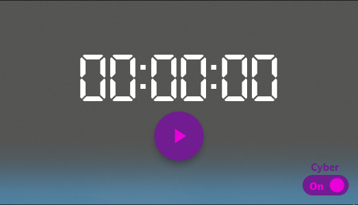
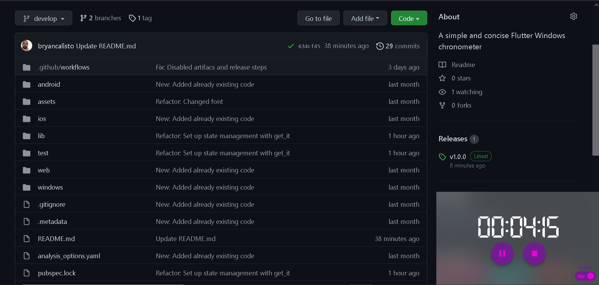
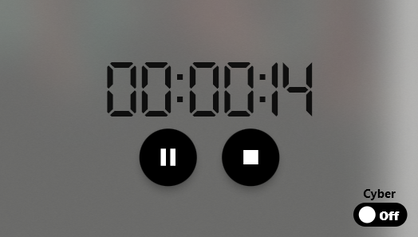
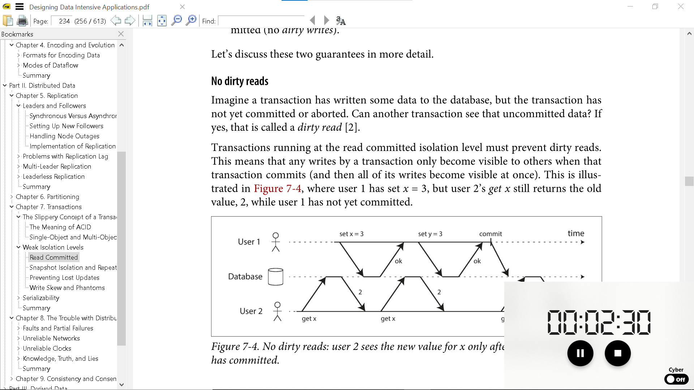

# Clocker

A simple and concise Flutter Windows chronometer.

#### UI
 

 

 

 

#### Key shortcuts
- **Space bar:** Start, pause, continue.
- **s:** Stop.
- **r:** Restart.
- **t:** Toggle theme.
